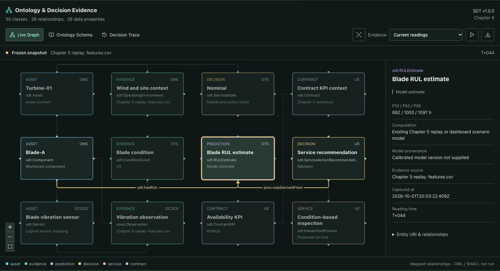
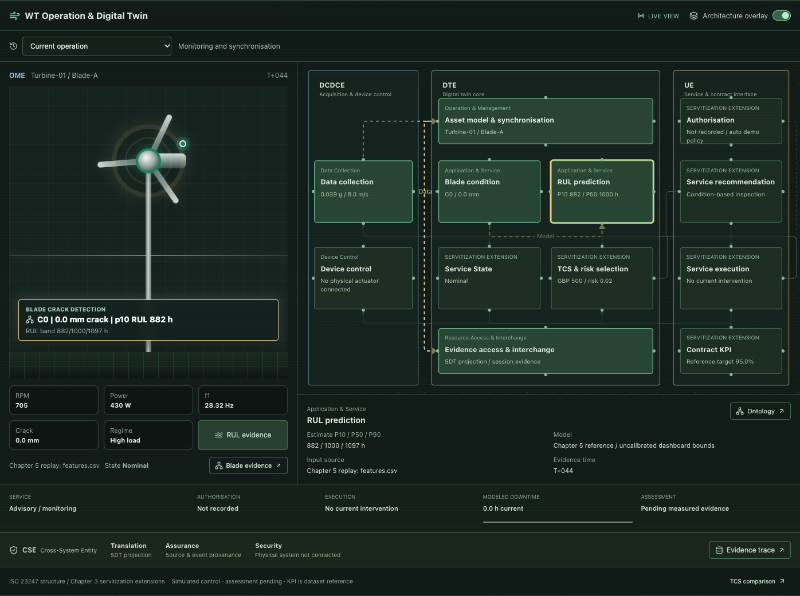
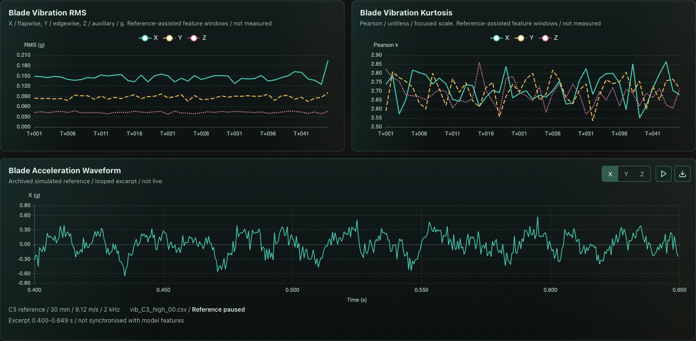
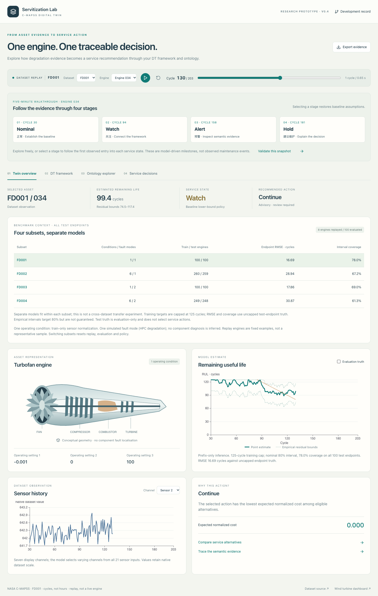
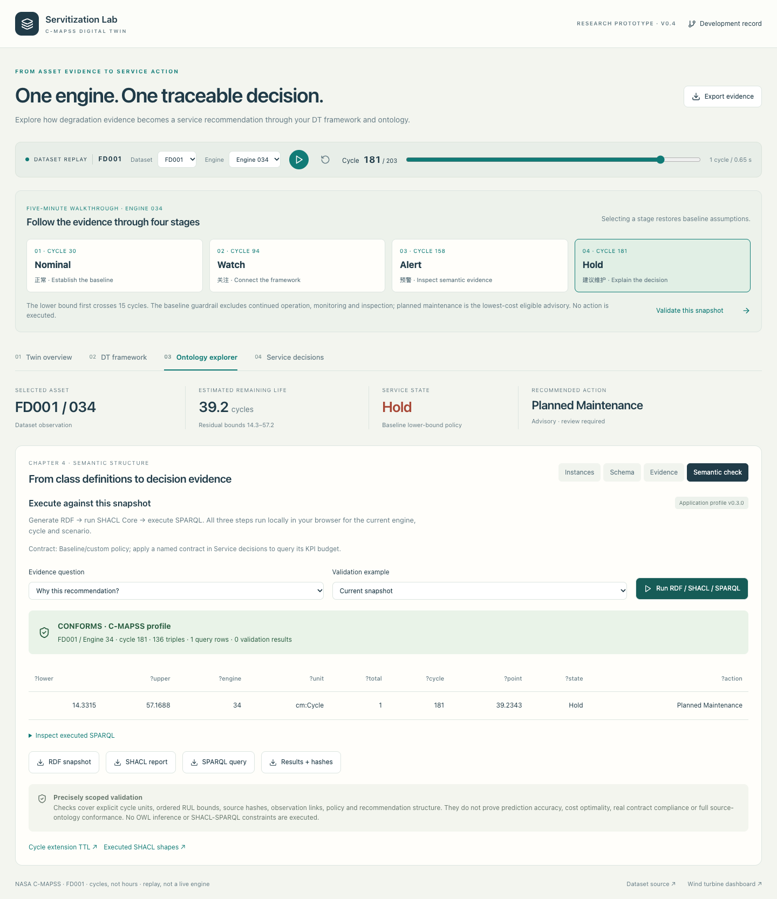

# WT Servitization Digital Twin Dashboard

Public dashboard URL: [https://jerryma619.github.io/wt-servitization-dashboard/](https://jerryma619.github.io/wt-servitization-dashboard/)

Enhanced public dashboard URL: [https://jerryma619.github.io/wt-servitization-dashboard/enhanced/](https://jerryma619.github.io/wt-servitization-dashboard/enhanced/)

Local dashboard URL: [http://127.0.0.1:5173/](http://127.0.0.1:5173/)

Enhanced local dashboard URL: [http://127.0.0.1:5173/enhanced](http://127.0.0.1:5173/enhanced)

The public repository deploys both routes through GitHub Actions. Local URLs are accessible only on the computer running the development server.

## Overview

This dashboard demonstrates a wind turbine servitization digital twin for blade crack detection and RUL-driven service decision-making. It links WT operation data, GPS/site context, wind conditions, blade vibration, crack growth, RUL estimation, service-state classification, automatic service selection, downtime tracking, and Total Cost of Servitization (TCS).

The implementation is aligned with the project theme of digital twinning servitization for high-value assets, using an ISO 23247-inspired evidence chain and an ontology-based data structure.

## Main Features

- WT operation animation with blade crack growth from 0 mm.
- GPS and real site map context.
- Wind speed, wind direction, vibration, crack state, and RUL monitoring.
- Automatic crack detection, RUL recalculation, service selection, downtime simulation, and WT state update.
- Service decision layer for predictive, preactive, proactive, active, and corrective maintenance.
- TCS comparison across service strategies.
- Cost item breakdown for service, downtime, logistics, contract exposure, and residual risk.
- Integrated turbine / ISO 23247 architecture overlay with state-driven flow highlighting.
- Recorded service-event replay synchronizing blade crack, RUL, rotor targets and modeled downtime.
- Interactive ontology instance graph, source-derived class explorer and service decision history on both dashboard routes.

## Ontology Module

The **Ontology & Decision Evidence** section sits below WT operation and TCS/service decision panels. It includes:

- **Live Graph:** select an entity to inspect readings, class mapping, source and directional relationships; focus its neighborhood, freeze a snapshot, choose a historical service event or download its evidence JSON.
- **Ontology Schema:** search the 50 native Chapter 4 classes, browse module groups, direct superclass declarations and applicable SDT properties. T-Box and SHACL source files are downloadable.
- **Decision Trace:** preserve the latest 30 service events in this browser, including original proposals, elapsed downtime, simulated results and explicit interruptions. Reload restores saved history.

The T-Box is a licensed source snapshot, parsed with N3 into `src/data/ontologySchema.json`. The instance graph is a dashboard projection, not SPARQL query or OWL reasoner output. SHACL definitions are available but live SHACL validation is not executed. Human authorisation, measured intervention assessment and model/policy feedback are not supplied by the simulator and remain explicitly unconfirmed. ISO entity labels are dashboard mappings, separate from OWL class inheritance. Cost values come from the existing TCS model, not native SDT cost properties.

Design, implementation, changes and validation evidence: [implementation log](docs/ontology/IMPLEMENTATION_LOG.md), [module specification](docs/ontology/DESIGN.md), [interaction verification](screenshots/ontology/verification.json), [public deployment verification](screenshots/ontology/publication.json).



## Integrated Digital Twin Workspace

Both routes start with **WT Operation & Digital Twin**, with the animated turbine and **Architecture overlay** visible by default. The framework stays visible across monitoring, decisions, maintenance, post-service updates and subsequent cycles; only the user can hide it. Inspect OME, DCDCE, DTE, UE and the cross-system CSE band. DTE separates Operation & Management, Application & Service, and Resource Access & Interchange. Service-state, TCS, authorisation and contract modules are research extensions, not additional ISO-mandated entities.

Select the blade or **RUL evidence** to highlight the matching architecture module. Node details link to the ontology evidence, and the live TCS link opens the comparison section. Once an automatic intervention is recorded, choose it from the event selector or use **Replay on turbine** in Decision Trace. Step, play or pause the recorded pre-service, downtime and post-service snapshots; **Return to live operation** restores current readings. The rest of the dashboard remains live during replay, clearly separated from the historical workspace.

Replay uses the same bounded session event store as ontology. Original intervention costs / recommendation are preserved even when post-service readings imply a new recommendation. Downtime hours are compressed model time, not elapsed real hours. The replay is a recorded simulation walkthrough, not a measured execution trace or engine performance profile. Authorization, physical actuation and measured outcome assessment are not connected. Contract KPI remains a Chapter 5 dataset reference. Manual scenarios still use the existing input window and do not auto-execute services.

Design and process record: [workspace specification](docs/twin/DESIGN.md), [implementation log](docs/twin/IMPLEMENTATION_LOG.md), [browser verification](screenshots/twin/verification.json), [public verification](screenshots/twin/publication.json).

Continuous Framework fix: [root cause and repair](docs/twin/FRAMEWORK_CONTINUITY_FIX.md), [two-cycle visibility/flow regression](screenshots/framework/verification.json). New telemetry preserves measured graph dimensions; completion does not hide the framework or stop live monitoring flow.



## Audit Repairs and Model Scope

The history toolbar exports/imports validated JSON and clears local history with confirmation. Unfinished work is closed as interrupted on reload or manual replacement; partial downtime is retained, with no fabricated repaired result. Localhost and public Pages have separate browser-origin histories. No personal event/GPS history is automatically sent to GitHub.

Current RUL calculations use **responsive XGBoost with a window-calibrated envelope** (`ch5-xgb-cqr-2.0`): 31 Chapter 5 features, 300 trees per quantile, depth 6, rate 0.05, seed 42 and fixed initial prediction 500. Disjoint sets contain 189 training / 63 calibration / 63 test windows; no final refit uses held-out rows. All three quantiles respond to source features. On the same test windows, mean interval width changes from 787.55 to 303.85 pseudo-h, with 90.48% coverage for a nominal 80% envelope. P10/P90 displayed values are calibrated percentile-based bounds, not exact percentiles. Original model artifacts remain unchanged for comparison. Synthetic hours and source-window calibration are **not validated physical lifetime or field coverage**. Model Heuristic Scores remain non-probabilistic; enhanced KPI separates session availability from fixed Chapter 5 references.

Process and equations: [repair log](docs/fixes/IMPLEMENTATION_LOG.md), [model basis](docs/model/MODEL_BASIS.md), [browser results](screenshots/fixes/verification.json). Real sensing/control, approval, measured effect and live SHACL remain pending.

XGBoost sources, fitted models and validation: [current calibration record](docs/model/CALIBRATED_XGBOOST.md), [current manifest](models/chapter5-calibrated/manifest.json), [current Python/browser parity](models/chapter5-calibrated/browser-parity.json), [public browser verification](screenshots/xgboost/public/verification.json), [historical integration record](docs/model/XGBOOST_IMPLEMENTATION.md), [preserved original manifest](models/chapter5/manifest.json). Full named feature JSON windows can be imported in Input Scenario. Automatic/basic manual scenarios explicitly use reference-assisted features with no validated coverage; manual RUL overrides retain their own provenance. Existing immutable service events retain historical model versions.

## Vibration Monitoring

Blade vibration now has separate **X/Y/Z RMS (g)** and **Pearson kurtosis (unitless)** charts, with distinct colors/line styles and no invented noise or curve smoothing. The primary vibration metric shows X/flapwise RMS when available. Existing signal-policy inputs remain Z RMS/kurtosis and are explicitly labelled; unknown historical axes are gaps, not zeros.

The **Blade Acceleration Waveform** player shows unscaled excerpts from 21 Chapter 5 archived **simulated** CSVs. It offers X/Y/Z selection, play/pause and JSON download, defaults to pause for reduced motion and pauses during simulated WT hold. Reference playback does not advance WT simulation or downtime statistics. These references are not live sensors and are not synchronised with the RUL feature snapshot. The archive loads only near the waveform panel.

Source review, missing acquisitions, model-snapshot mismatch, chart definitions and verification: [vibration display record](docs/model/VIBRATION_DISPLAY.md), [waveform manifest](models/vibration/waveform-manifest.json), [CSV/export parity](models/vibration/source-parity.json), [local browser verification](screenshots/vibration/verification.json).

Published standard/enhanced routes also pass the same browser checks: [public verification](screenshots/vibration/public/verification.json), [public desktop screenshot](screenshots/vibration/public/enhanced-desktop.png), [public mobile screenshot](screenshots/vibration/public/enhanced-mobile.png).



## Sensor References

WT Operation, Data Collection and the ontology Sensor node show the rig's **Accel 18 Click (MC3419)** reference, including 80% blade-span / suction-side placement. Auxiliary wind instruments and electrical/tachometer channels are identified by type only; unconfirmed models are not guessed. All hardware remains labelled not connected. Crack and RUL are model/replay outputs, not direct sensor readings.

Source review, implementation decisions and limitations: [instrumentation record](docs/model/INSTRUMENTATION_REFERENCE.md). Layout and interaction evidence: [local browser verification](screenshots/instrumentation/verification.json), [public browser verification](screenshots/instrumentation/public/verification.json).

## Local Development

```bash
npm install
npm run dev
```

Local dashboard:

```text
http://127.0.0.1:5173/
http://127.0.0.1:5173/enhanced
```

## Build

```bash
npm run build
```

The production build is generated in `dist/`.

## Ontology Verification

Use Node.js 22.6 or later for the TypeScript model tests (the deployment workflow uses Node 22):

```bash
npm run sync:ontology
npm run check:ontology
npm run test:ontology
npm run test:twin
npm run test:model
npm run build
```

`sync:ontology` rebuilds the committed schema from `public/ontology/sdt_tbox.ttl`. `check:ontology` fails if the source and generated schema disagree. Graph/model tests verify known classes and predicates, immutable before/after evidence, bounded event storage and advisory status. Both checks run before Pages deployment.

Browser verification requires Playwright and a Chromium browser. With Playwright available in the environment and the local dev server running:

```bash
node scripts/verify-ontology-ui.mjs
node scripts/verify-twin-ui.mjs
node scripts/verify-fixes-ui.mjs
node scripts/verify-framework-cycle.mjs
```

Environment variables: `PLAYWRIGHT_MODULE` (absolute installed Playwright module path), `CHROME_EXECUTABLE` (browser executable), and optional `DASHBOARD_URL` (default `http://127.0.0.1:5173/`). The repair verification script uses the first two variables; other browser scripts can use a normally installed Playwright package. Results are saved under `screenshots/ontology/`, `screenshots/twin/` and `screenshots/fixes/`. Tests accelerate only the simulator in isolated tabs; normal application timing is unchanged.

`node scripts/verify-ontology-publication.mjs` checks the public standard/enhanced routes, ontology browser and source download using the same optional browser environment variables. Its default URL is the GitHub Pages site; results are written to `screenshots/ontology/publication.json`.

`node scripts/verify-fixes-publication.mjs` checks deployed history tools, architecture reachability, deferred charts and enhanced model/KPI scope. Results: `screenshots/fixes/publication.json`.

## Data

Dashboard data is stored in `src/data/dashboardData.json`. The Chapter 5 data sync script is:

```bash
npm run sync:data
```

## Deployment

The repository includes a GitHub Pages workflow at:

```text
.github/workflows/deploy-pages.yml
```

The Vite production base path is configured for:

```text
/wt-servitization-dashboard/
```

## C-MAPSS prototype

The `/cmapss/` route adds an FD001 replay demonstration with synchronized engine telemetry, RUL, ISO 23247-inspired framework mapping, ontology exploration and normalized-cost service advice. Local preview: `npm run dev -- --port 5178`, then <http://127.0.0.1:5178/cmapss/>.

- [Demonstration guide](docs/cmapss/DEMO.md)
- [Data, model, units and evidence limits](docs/cmapss/DATA.md)
- [Implementation and verification record](docs/cmapss/IMPLEMENTATION_LOG.md)
- [Tracking issue #1](https://github.com/JerryMa619/wt-servitization-dashboard/issues/1)



### Guided and semantic workflow (v0.2)

Four Engine 034 milestone buttons connect the replay to framework, ontology and service decisions. **Ontology → Semantic check** now generates RDF and executes SPARQL / SHACL Core locally, including missing-unit and missing-evidence counterexamples. The explicit cycle extension avoids hours-valued assertions. [Walkthrough, scope and reproducibility](docs/cmapss/SEMANTIC_WORKFLOW.md).



### Contract comparison (v0.3)

**Service decisions** compares two explicit contract assumptions against identical engine evidence. Engine 034 cycles 158 and 171 demonstrate cost-driven and intervention-margin-driven differences. Applying a contract links it to the existing policy, RDF/SPARQL/SHACL workflow and exports; manual changes detach that named policy. KPI budgets are hypothetical cycle-opportunity calculations, not measured time availability. [Assumptions, walkthrough and verification](docs/cmapss/CONTRACT_SCENARIOS.md).

### C-MAPSS v0.4: FD001–FD004

The `/cmapss/` demonstration now offers four separately fitted subset models, on-demand replay, full-test endpoint metrics and dataset-aware ontology/contract evidence. The existing FD001 guide is preserved. See [four-subset methodology and audit](docs/cmapss/MULTI_DATASET.md); original file counts, source hashes and all endpoint evaluation records are included. Run `npm run test:cmapss:datasets` for the new regression suite.
