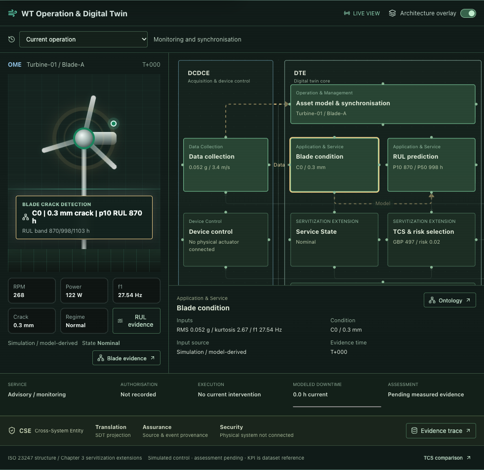

# Dashboard Review - 2026-10-01

## Scope

Reviewed implementation at commit `2eada16` on both local dashboard routes, with particular attention to state classification, service interruption, ontology / replay evidence integrity, model boundaries, quality claims, cumulative KPI and responsive architecture. No production code or model parameters changed during this review.

Assessment: useful as a simulation demonstration, but **needs revision** before treating service state, accumulated KPI or quality indicators as dependable decision evidence. Model probabilities and real-world maintenance efficacy were not independently validated. This review does not establish ISO conformity.

## Confirmed Findings

### 1. P1 - Higher damage can downgrade a critical RUL state

[Source: serviceStateFromCondition](https://github.com/JerryMa619/wt-servitization-dashboard/blob/2eada16/src/App.tsx#L197)

Crack / vibration branches return before RUL is evaluated. Fixture: P10 = 10 h, RMS = 0.07 g, kurtosis = 3. At crack 19.9 mm, RUL gives Critical; at 20 mm, condition classification gives Watch. A worse crack can therefore reduce the displayed urgency, while the service candidate selector still takes low RUL into account.

Required fix: combine independent damage, vibration and RUL severities with a documented priority policy. If reduced severity is an intentional policy exception, make that explicit and do not display a contradictory low-risk activity. Add boundary tests around 20 / 30 / 45 / 60 mm and RUL thresholds.

### 2. P1 - Selecting another event can mix its execution with an old replay frame

[Source: frozen snapshot precedence](https://github.com/JerryMa619/wt-servitization-dashboard/blob/2eada16/src/ontology/OntologyPanel.tsx#L68), [event selection / View graph](https://github.com/JerryMa619/wt-servitization-dashboard/blob/2eada16/src/ontology/OntologyPanel.tsx#L128)

Browser reproduction: replay completed event A to its post-service result; open Blade evidence; switch to Decision Trace; select completed event B; click View graph. Neither trace event selection nor View graph clears A's `frozen` snapshot. Downloaded JSON contains A's 19.7 mm post-service reading alongside B's 45.2 mm pre-service evidence and execution ID. This creates a combined graph / exported evidence record for different interventions.

Required fix: keep an explicit event + frame selection together, clearing or reselecting its frame atomically. Verify exported snapshot IDs belong to the selected event and preserve separate proposal provenance. Add a two-event replay-to-trace regression test.

### 3. P2 - Manual input abandons maintenance without closing its event

[Source: manual scenario effect](https://github.com/JerryMa619/wt-servitization-dashboard/blob/2eada16/src/App.tsx#L517)

Browser reproduction: while predictive maintenance is in downtime, apply a manual scenario. The runtime reference is cleared, but the service panel still says Downtime in progress and the event remains in-progress. After Resume replay, a new intervention can complete while the abandoned event stays In downtime indefinitely. The runtime, panel, ontology and downtime totals no longer share a complete lifecycle.

Required fix: implement explicit paused / cancelled / interrupted states, capture elapsed modeled downtime, and choose whether resume continues that intervention or closes it before starting another. Do not count a cancelled intervention as completed.

### 4. P2 - Operating limits differ between manual, automatic and post-service models

[Source: manual wind coupling](https://github.com/JerryMa619/wt-servitization-dashboard/blob/2eada16/src/App.tsx#L2046), [post-service power](https://github.com/JerryMa619/wt-servitization-dashboard/blob/2eada16/src/App.tsx#L1928)

Direct execution of the original source functions gives manual wind 0 m/s -> 7 RPM, even though automatic simulation and post-service restoration use zero RPM below 3 m/s. At wind 15 m/s, manual / automatic power is capped at 800 W; post-service restoration gives 2263 W; the next simulation tick returns to 800 W. These discontinuities do not represent an input or operating change.

Required fix: share the same operating-envelope function and limits across all three paths. Preserve intentional model differences separately from physical output bounds. Specify turbine-scale units and any cut-out behavior from case-specific parameters rather than inventing limits.

### 5. P2 - Cumulative KPI combines live modeled values and static references

[Source: cumulativeKpis](https://github.com/JerryMa619/wt-servitization-dashboard/blob/2eada16/src/App.tsx#L1842)

With current availability 95%, six services and 48 h accumulated downtime, the output still reports a fixed 120 h avoided downtime calculated from the Chapter 5 planned 24 h; availability simultaneously states baseline 85.6% and delta 12.0 pp, even though 95% - 85.6% is 9.4 pp. Settlement stays the fixed BONUS GBP 520 with reference actual 97.6%. This module's cumulative/live presentation does not clearly separate those scopes, even though the new architecture workspace labels KPI as reference-only.

Required fix: distinguish Chapter 5 reference KPI from session KPI in the actual KPI / decision panels. Any live availability / avoided downtime / settlement calculation needs a consistent observation window and accumulated downtime ledger; do not subtract unrelated windows or assert avoided downtime without a suitable counterfactual.

### 6. P2 - Telemetry freshness always passes

[Source: dataQualityRows](https://github.com/JerryMa619/wt-servitization-dashboard/blob/2eada16/src/App.tsx#L1755)

Freshness status is unconditionally pass. A fixture labelled old-reading / manual-input produces the same pass. VC1 / VC2 values also come from the fixed dataset, not a current measurement or audit, but are presented in the same quality section.

Required fix: separate observation time, source replay time and received-at time; evaluate staleness against source-specific limits. Mark manually held scenarios, replay reference checks and unavailable timestamps appropriately. Keep source validation results distinct from live quality checks.

### 7. P2 - Narrowing a desktop window makes architecture nodes inaccessible

[Source: ReactFlow viewport settings](https://github.com/JerryMa619/wt-servitization-dashboard/blob/2eada16/src/twin/TwinWorkspace.tsx#L120), [responsive canvas rules](https://github.com/JerryMa619/wt-servitization-dashboard/blob/2eada16/src/twin/twin.css#L104)

Browser reproduction: open overlay at 1440 px, then resize to 1024 px. The existing fitView transform is not recomputed. Canvas right edge becomes x=1002, while authorisation, recommendation, execution and KPI nodes extend to about x=1209.7. No horizontal scroll is available above the 820 px breakpoint, and drag panning is disabled. The smaller canvas height also clips the bottom architecture row. No outer-page overflow occurs, so existing overflow-only checks miss the problem.

Required fix: refit after canvas resize or provide an internally scrollable fixed-format graph for intermediate widths. Tests must check containment / reachability of all 12 nodes, not just the document width.

## Additional Improvements

- Model Confidence currently computes heuristic percentages from signal severity, RUL spread / recent movement and policy risk. Label them heuristic scores unless calibrated against suitable held-out data. Expose model version, parameter basis, validation scope and uncertainty definitions.
- Validate input ranges before applying a scenario, including GPS latitude / longitude, negative values and model-range boundaries. Current GPS values pass through without range checks; several other values are silently clamped while preview text still refers to the raw form.
- A missing execution node currently falls back to the first ontology node (Asset). Disable unavailable node links or show an explicit No execution evidence state rather than navigating to an unrelated entity.
- Historical evidence is session-only and bounded to 30 events. Pin the event data alongside a linked frozen graph so pruning cannot silently remove execution / proposal provenance. Persistent storage / export-import would improve reproducibility.
- Real sensor / calibrated model integration, authorisation, measured outcome assessment, feedback and live SHACL validation remain explicit prototype gaps, not newly verified implementations.
- The production bundle remains about 1.735 MB raw / 536 KB gzip. Lazy-loading charts, ontology and architecture would improve initial loading; this is secondary to correctness fixes.

## Verification and Limitations

- `npm run test:ontology`: 5 passed.
- `npm run test:twin`: 5 passed.
- `npm run build`: passed with the existing large-bundle warning.
- Executed original App functions selected through the TypeScript AST and transpiled to JavaScript in an isolated VM. No formulas were manually reimplemented for the numeric reproductions.
- Chrome / Playwright confirmed interrupted service history, cross-event frozen evidence mixing and 1440 -> 1024 viewport clipping. Only the simulation interval was accelerated in isolated test tabs; application source was unchanged.
- Existing tests do not cover severity monotonicity, interruption, event switching while frozen, common operating limits, live/reference KPI consistency, freshness evaluation or all-node reachability after desktop resizing.
- No new proof of physical accuracy, predicted failure probability, actual maintenance effectiveness or live contract settlement is claimed.

Recommended order: correct state severity and cross-event evidence first; unify lifecycle / operating bounds next; reconcile KPI and quality scopes; then repair responsive viewport behavior and expand regression coverage.
